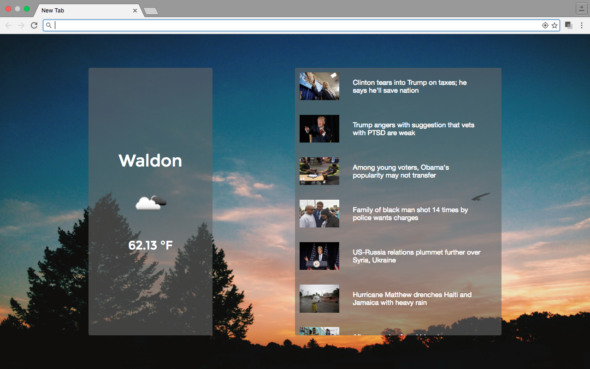
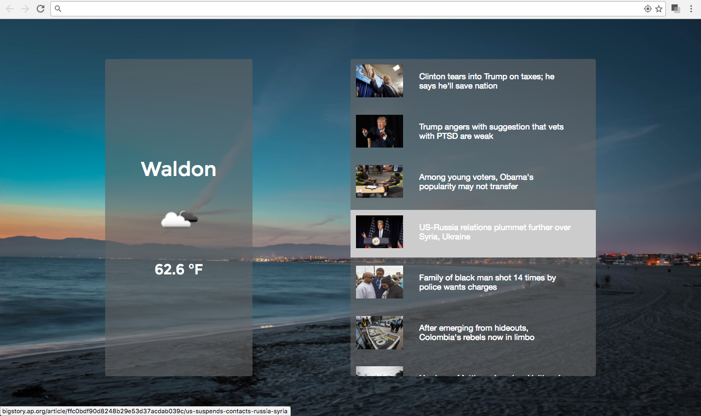

## Simple New Tab Chrome Extension

### Background

I wanted to create a simple, clean New Tab page for Chrome that displays the
current weather in the user's area, as well as a list of current news headlines. The New Page Extension can be downloaded from the Chrome Web Store [here](https://chrome.google.com/webstore/detail/simple-new-tab/gjelabfnalcklnibgagdlpmdhmkcpkbm).

### Features

The new page appears on a background image which is drawn from the SplashBase
API. The call to the API is asynchronous, and asks for a random image, so that a different background image appears each time.

The page features weather information as well. Location information is received from Chrome's geolocation API as latitude and longitude coordinates. These coordinates are then passed to the OpenWeatherMap's current weather API to get current weather data for the user's area.

Finally, the extension uses NewsAPI to get the latest headlines and their associated thumbnails from Associated Press. These headlines are displayed on a page, and each headline is a link to the full story on the Associated Press website.

